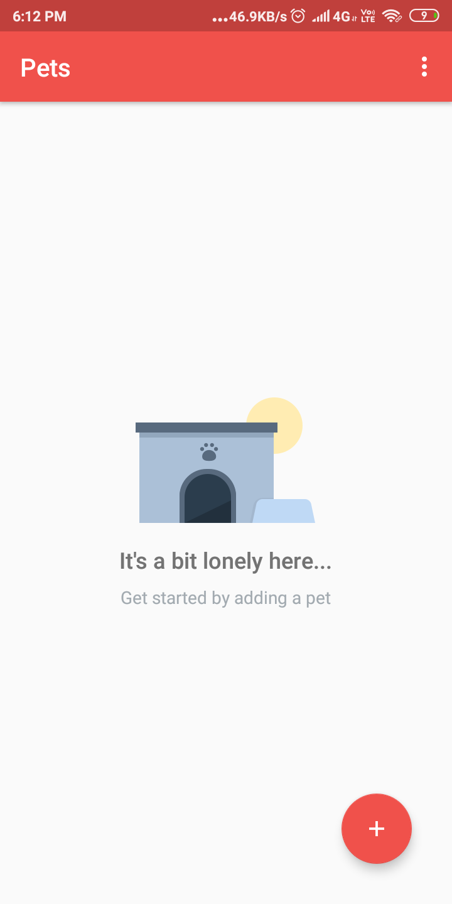
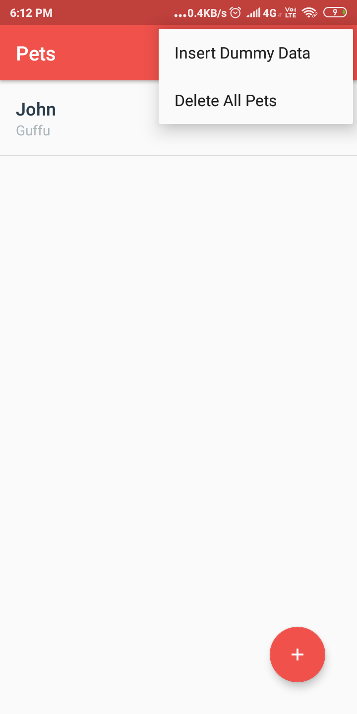
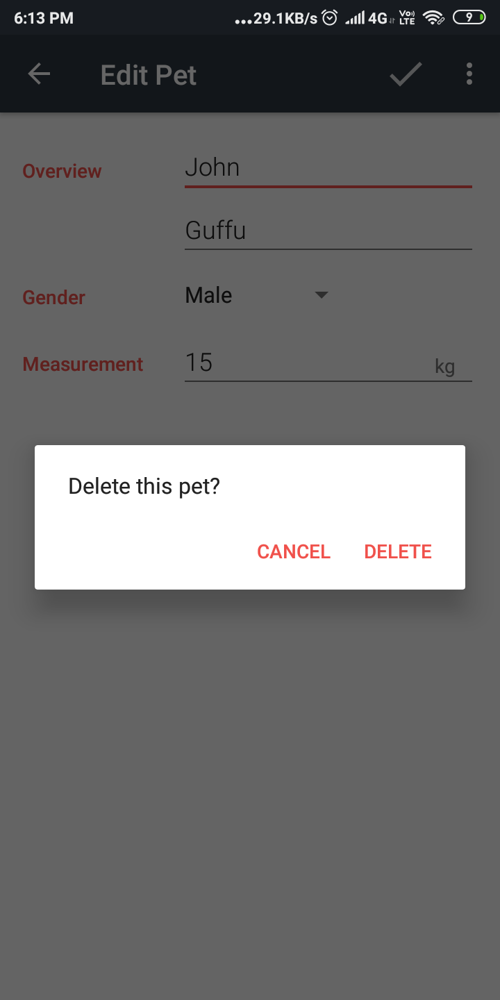

# Pets App (Android architecture components and Android Local DataBase)

This app save data of Pets Like Name,age,Breed,Gender and Weight.
It is Made using **Android components**.
**Content Provider and Content resolver Used**.
**Cursor and CursorLoader Used**.This app is part of Udacity android data storage.This app also show's that **how to get or query data from only two columns in the table and Display in ListView in Local persistence library or Local Database**.

### Note:-

Here we are using **Cursor Loader**. 
You can Check this documentation for Loader 

### Question:-

- Database Operations use:-

 1) Insert.
 2) Update.
 3) Delete.
 4) Query
- Android Library Used:-
 1) SQliteDataBase
 2) ContentProvider
 3) ContentResolver
 4) Cursor
 5) CursorLoader
 6) Intent
  

It also show's you that how to display alertdialog if the user have Click on the EditText View.

## Screenshots:-

 

 
 
